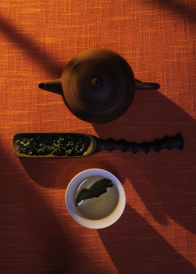

<!--  -->
## A Considered Ritual for Focus

In a culture shaped by constant input and acceleration, mental clarity has become less about sharpness and more about organisation. Many people are not seeking more energy, but a form of attention that feels steady, composed, and sustainable.

Oolong tea has long occupied this space.

Neither green nor black, neither overtly stimulating nor sedating, oolong is defined by balance. Its effects unfold gradually, supporting focus while easing mental tension. This is why it has historically been favoured in contexts of study, conversation, and reflection rather than urgency.

The clarity associated with oolong emerges through balance and repetition, not through force.

∗ ∗ ∗

## Focus without overstimulation

Oolong tea contains caffeine, but its effect differs markedly from coffee or other concentrated stimulants. This is due to the presence of **L-theanine**, a naturally occurring amino acid found in tea leaves.

L-theanine moderates the impact of caffeine, encouraging a calm and attentive mental state. Rather than producing a sharp rise in alertness, thoughts remain focus yet relaxed.

This pairing of caffeine and L-theanine helps explain why tea has long been associated with intellectual and creative work. The mind is awake without becoming tense.

∗ ∗ ∗

## A measured energy curve

The partial oxidation of oolong tea plays a significant role in how it feels to drink. Compared with green tea, slower caffeine release give it an energy that is rounder and more persistent. Compared with black tea or coffee, it is gentler and less abrupt.

This creates a more even experience, with fewer spikes and fewer crashes. Polyphenols present in oolong may help reduce cortisol activity, it also support the body’s response to stress, helping background tension diminish rather than accumulate.

The mellow impact on heart rate and anxiety is noticeable over time, especially for people who are sensitive to stronger stimulants.

∗ ∗ ∗

## Aroma and attention

Before taste, there is aroma.

Fine oolongs are often defined by restrained but complex aromatic profiles: orchid, warm grain, soft florals, mineral air. These aromas engage the limbic system, the part of the brain associated with emotion and memory, influencing mood before conscious thought intervenes.

The sensory cue of the steam from a freshly poured cup naturally slows attention. It separates the moment of drinking from what came before it, creating a restorative transition rather than a disruption.

∗ ∗ ∗

## The ritual of preparation

Preparation shapes the experience of oolong as much as the leaf itself.

The ritual begins with a choice to make time.

This may involve lighting an incense stick, clearing the table, or setting aside the phone. Not as a performance of relaxation, but as a way of marking a shift from activity to intention.

Bring the water to the boil, then let it cool slightly, according to the style and degree of fermentation of the tea. While the temperature settles, warm the brewing vessel and cups by rinsing them with hot water. This simple act serves a practical purpose, but it also sets the pace and removes haste.

Measure the tea with care and place it into the warmed vessel. Pour the water steadily. Keep the first infusion short, often around thirty seconds, using a timer if needed. Over time, timing gives way to familiarity.

When the tea is ready, pour it out completely into a shared serving vessel to ensure balance. Only then pour into cups.

Waiting does not interrupt the process. It defines it.

∗ ∗ ∗

## Learning to taste

Tasting oolong is an exercise in attention rather than judgement.

As with wine, aroma comes first. Notice the scent of the dry leaves, then the brewed tea. Consider whether it feels lifted or grounded, floral or mineral, warm or cool.

On the palate, texture often reveals more than flavour. Is the tea light or rounded, creamy or structured? How does it move across the mouth?

Flavour follows in layers rather than impact. Finally, observe the finish. Many fine oolongs leave a gentle sweetness or cooling sensation that returns quietly after swallowing, a quality often enhanced by careful fermentation.

Across successive infusions, the tea evolves into a more composed and coherent expression.

∗ ∗ ∗

## Why oolong resonates now

Through craft, repetition, and attention rather than optimisation, oolong supports focus without urgency and rewards patience rather than speed.

By allowing attention to become more organised, less fragmented, and easier to sustain, this measured clarity feels less like an escape and more like a return to rhythm, proportion, and intent.