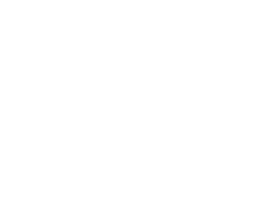

## Not a Tea Plant. *The* Tea Plant's Wild Cousin

Nearly everything the world calls "tea" — green, black, oolong, white — comes from one species, *Camellia sinensis*, cultivated and refined over centuries into countless regional varieties. Taiwan, though, is home to something else: *Camellia formosensis*, commonly known as Taiwan mountain tea.

For most of the 20th century, botanists assumed it was simply a local variant of ordinary tea. That changed in 2009, when genetic analysis of its nuclear DNA showed something surprising — Taiwan mountain tea forms its own distinct evolutionary branch, separate from both the small-leaf tea grown across most of Taiwan and the large-leaf Assam tea used for classic black teas. It was reclassified as a species in its own right.

The story goes back further than that, though. Genetically, Taiwan mountain tea appears to be a relict species — a survivor from a much older era, isolated on the island long enough to evolve independently while its relatives elsewhere in Asia continued to change. Botanists sometimes call plants like this "living fossils." Historical records back up how long people have known about it, too: Qing dynasty gazetteers from the early 1700s already mention a distinctive mountain tea deep in Taiwan's interior, prized for its unusual flavor and its reputed ability to cool the body in summer heat.

  

## A Tree That Won't Be Farmed

Unlike the neat, waist-high tea bushes grown on most plantations, Taiwan mountain tea grows as an actual tree — sometimes reaching several meters tall — scattered through the understory of old-growth forest rather than lined up in a cultivated field. It's currently known from only a handful of mountain regions across central, southern, and eastern Taiwan, generally between 600 and 1,600 meters elevation. Liugui, where this tea is foraged, is one of them, sitting near where the Central Mountain Range meets the Pingtung plain.

Because much of this tree's habitat sits on protected forest land, growers can't prune it, fertilize it, or manage it the way a conventional tea garden is managed. Harvesting means going to where the trees already are — climbing into dense, often steep terrain, by hand, during a short seasonal window. There's no way to scale this up. What comes out of that harvest is genuinely limited, which is a large part of why tea made from it commands a different kind of attention — and a different price — than tea from a cultivated garden.

  

## What Makes the Leaf Itself Different

Beyond the rarity, Taiwan mountain tea has a distinct chemical fingerprint. It naturally runs lower in caffeine and higher in amino acids than cultivated tea, which tends to produce a smoother, sweeter cup with less of the bitterness or astringency associated with stronger teas. Because each tree has typically grown from seed rather than being cloned like a commercial cultivar, no two trees — sometimes even in the same patch of forest — taste quite the same. Tasters often describe the raw character as mossy, earthy, faintly like mushroom or truffle, carrying something of the forest floor it grows in.

  

## Forager's Delight: Letting the Leaf Speak for Itself

Turning a leaf like this into tea is as much a decision about restraint as it is about technique. Of the styles this tea can be made into, white tea is generally considered the one that interferes least — no rolling, no pan-firing, just a long, careful withering that lets the leaf's own character come through largely unaltered. That's the process behind Forager's Delight: a "fresh-style" white tea approach designed specifically to preserve the pure, lively flavor of the wild leaf rather than layering a heavier hand of processing on top of it.

The result opens with a bright note of citrus, settles into something woody with a whisper of cinnamon, and finishes cool — almost minty — with a natural cane-sugar sweetness underneath. None of it arrives all at once. The tea maker's own description of it puts this best: the real appeal of a fragrance like this isn't intensity, it's that each time you smell it or taste it, there's something new to notice.

  

## A Tea Worth Slowing Down For

Forager's Delight isn't a tea built for a rushed morning. It's silky rather than bold, delicate rather than assertive, and it rewards patience — both in the brewing and in the drinking. Given how limited the harvest is each year, and how much of its character depends on gentle handling from forest to cup, it's less a daily-drinker and more an occasion: a quiet walk, a slow morning, a moment set aside to actually pay attention to what's in the cup.

  